University: [ITMO University](https://itmo.ru/ru/)  

Faculty: [FICT](https://fict.itmo.ru)  

Course: [Introduction in routing](https://github.com/itmo-ict-faculty/introduction-in-routing)  

Year: 2025/2026 

Group: K3321 

Author: Царёв Александр Сергеевич

Lab: Lab1  

Date of create: 14.03

Date of finished:  

# Lab1. Построение трехуровневой сети в ContainerLab

## Цель работы

Ознакомиться с инструментом ContainerLab и методами работы с ним, изучить работу VLAN, IP адресации.

## Задание

В рамках лабораторной работы требовалось:

- развернуть в ContainerLab топологию сети, состоящую из устройств `R01`, `SW01`, `SW02A`, `SW02B`, `PC1` и `PC2`;
- настроить два VLAN для конечных узлов;
- настроить trunk и access-порты;
- настроить DHCP-серверы на центральном маршрутизаторе;
- добиться получения IP-адресов по DHCP на `PC1` и `PC2`;
- настроить имена устройств и сменить пароль пользователя.

## Топология лабораторной сети

В лабораторной работе использовалась следующая топология:

- `R01` — центральный маршрутизатор
- `SW01` — коммутатор распределения
- `SW02A` — коммутатор доступа для `PC1`
- `SW02B` — коммутатор доступа для `PC2`
- `PC1` — клиент VLAN 10
- `PC2` — клиент VLAN 20

### Соединения между устройствами

- `R01:eth1 <-> SW01:eth1`
- `SW01:eth2 <-> SW02A:eth1`
- `SW01:eth3 <-> SW02B:eth1`
- `SW02A:eth2 <-> PC1:eth1`
- `SW02B:eth2 <-> PC2:eth1`

### IP-адреса для подключения по SSH

- `R01` — `172.20.20.10`
- `SW01` — `172.20.20.11`
- `SW02A` — `172.20.20.12`
- `SW02B` — `172.20.20.13`

## Схема связи

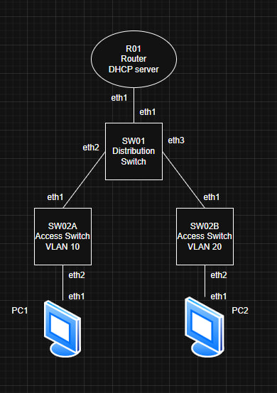

## Файл развертывания ContainerLab

Для развёртывания виртуальной сети использовался следующий файл `lab1.clab.yaml`.

```yaml
name: lab1

mgmt:
  network: clab-mgmt
  ipv4-subnet: 172.20.20.0/24

topology:
  nodes:

    R01:
      kind: vr-mikrotik_ros
      image: vrnetlab/mikrotik_routeros:6.47.9
      mgmt-ipv4: 172.20.20.10

    SW01:
      kind: vr-mikrotik_ros
      image: vrnetlab/mikrotik_routeros:6.47.9
      mgmt-ipv4: 172.20.20.11

    SW02A:
      kind: vr-mikrotik_ros
      image: vrnetlab/mikrotik_routeros:6.47.9
      mgmt-ipv4: 172.20.20.12

    SW02B:
      kind: vr-mikrotik_ros
      image: vrnetlab/mikrotik_routeros:6.47.9
      mgmt-ipv4: 172.20.20.13

    PC1:
      kind: linux
      image: alpine:latest

    PC2:
      kind: linux
      image: alpine:latest

  links:
    - endpoints: ["R01:eth1","SW01:eth1"]
    - endpoints: ["SW01:eth2","SW02A:eth1"]
    - endpoints: ["SW01:eth3","SW02B:eth1"]
    - endpoints: ["SW02A:eth2","PC1:eth1"]
    - endpoints: ["SW02B:eth2","PC2:eth1"]
````

## Развёртывание сети

Для запуска виртуальной сети использовались следующие команды:

```bash
sudo containerlab destroy -t lab1.clab.yaml --cleanup
sudo containerlab deploy -t lab1.clab.yaml
sudo containerlab inspect -t lab1.clab.yaml
```

После развёртывания все контейнеры перешли в состояние `running`, а устройства MikroTik — в состояние `healthy`.

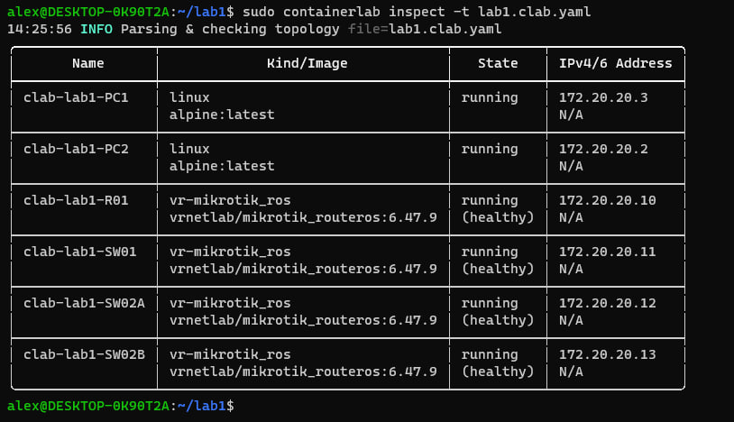

## Особенность используемого образа RouterOS

В процессе выполнения работы была обнаружена особенность образа `vrnetlab/mikrotik_routeros:6.47.9` в ContainerLab.

Несмотря на то, что в `.yaml` файле указывались интерфейсы `eth1`, `eth2` и `eth3`, внутри RouterOS реальные рабочие интерфейсы оказались сдвинуты на один порт. Из-за этого первоначально настроенная конфигурация не обеспечивала прохождение DHCP-трафика.

В результате фактически рабочие интерфейсы были определены следующим образом:

- `R01:eth2 <-> SW01:eth2`
- `SW01:eth3 <-> SW02A:eth2`
- `SW01:eth4 <-> SW02B:eth2`
- `SW02A:eth3 <-> PC1:eth2`
- `SW02B:eth3 <-> PC2:eth2`


После исправления привязки конфигурации к реальным интерфейсам сеть заработала корректно.

## План адресации и VLAN

Для сегментации сети были выбраны следующие VLAN:

* **VLAN 10** — сеть PC1
* **VLAN 20** — сеть PC2

### IP-план

| VLAN | Назначение | Подсеть           | Шлюз           |
| ---- | ---------- | ----------------- | -------------- |
| 10   | PC1        | `192.168.10.0/24` | `192.168.10.1` |
| 20   | PC2        | `192.168.20.0/24` | `192.168.20.1` |

### DHCP-пулы

* VLAN 10: `192.168.10.100 - 192.168.10.199`
* VLAN 20: `192.168.20.100 - 192.168.20.199`

## Конфигурация устройств

В данном разделе приведены итоговые рабочие конфигурации сетевых устройств.

## Конфигурация R01

На R01 были созданы два VLAN-интерфейса на `ether2`, назначены IP-адреса шлюзов, созданы DHCP-пулы и DHCP-серверы.

```rsc
/system identity set name=R01
/user set admin password=123

/interface vlan
add name=vlan10 interface=ether2 vlan-id=10
add name=vlan20 interface=ether2 vlan-id=20

/ip address
add address=192.168.10.1/24 interface=vlan10
add address=192.168.20.1/24 interface=vlan20

/ip pool
add name=pool_vlan10 ranges=192.168.10.100-192.168.10.199
add name=pool_vlan20 ranges=192.168.20.100-192.168.20.199

/ip dhcp-server
add name=dhcp_vlan10 interface=vlan10 address-pool=pool_vlan10 disabled=no
add name=dhcp_vlan20 interface=vlan20 address-pool=pool_vlan20 disabled=no

/ip dhcp-server network
add address=192.168.10.0/24 gateway=192.168.10.1 dns-server=8.8.8.8
add address=192.168.20.0/24 gateway=192.168.20.1 dns-server=8.8.8.8
```

### Проверка конфигурации R01

```rsc
/interface vlan print
/ip address print
/ip pool print
/ip dhcp-server print
/ip dhcp-server network print
/ip dhcp-server lease print
```

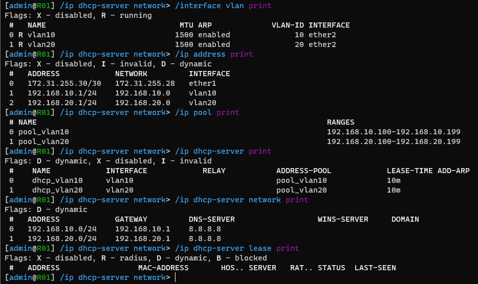

## Конфигурация SW01

На SW01 был создан bridge `br1`, настроены trunk-порты и таблица VLAN для VLAN 10 и VLAN 20.

```rsc
/system identity set name=SW01
/user set admin password=123

/interface bridge
add name=br1 vlan-filtering=no

/interface bridge port
add bridge=br1 interface=ether2
add bridge=br1 interface=ether3
add bridge=br1 interface=ether4

/interface bridge vlan
add bridge=br1 vlan-ids=10 tagged=br1,ether2,ether3,ether4
add bridge=br1 vlan-ids=20 tagged=br1,ether2,ether3,ether4

/interface bridge
set br1 vlan-filtering=yes
```

### Проверка конфигурации SW01

```rsc
/interface bridge print
/interface bridge port print
/interface bridge vlan print
```

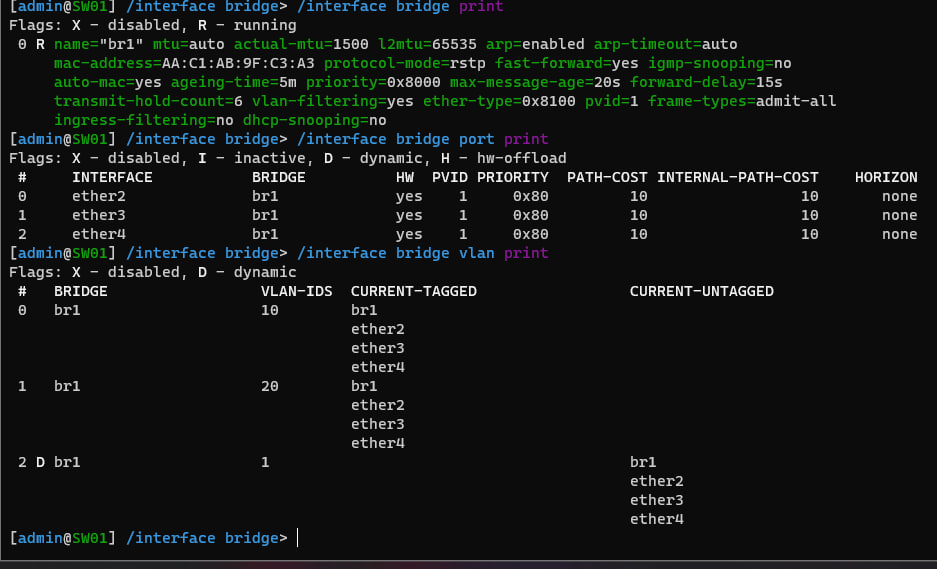

## Конфигурация SW02A

На SW02A uplink к SW01 был настроен как trunk-порт, а порт к PC1 как access-порт VLAN 10.

```rsc
/system identity set name=SW02A
/user set admin password=123

/interface bridge
add name=br1 vlan-filtering=no

/interface bridge port
add bridge=br1 interface=ether2
add bridge=br1 interface=ether3 pvid=10

/interface bridge vlan
add bridge=br1 vlan-ids=10 tagged=br1,ether2 untagged=ether3

/interface bridge
set br1 vlan-filtering=yes
```

### Проверка конфигурации SW02A

```rsc
/interface bridge print
/interface bridge port print
/interface bridge vlan print
```

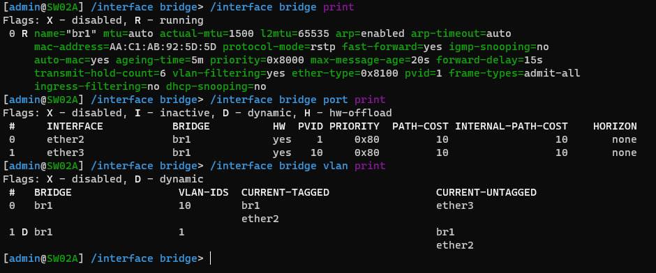

## Конфигурация SW02B

На SW02B uplink к SW01 был настроен как trunk-порт, а порт к PC2 как access-порт VLAN 20.

```rsc
/system identity set name=SW02B
/user set admin password=123

/interface bridge
add name=br1 vlan-filtering=no

/interface bridge port
add bridge=br1 interface=ether2
add bridge=br1 interface=ether3 pvid=20

/interface bridge vlan
add bridge=br1 vlan-ids=20 tagged=br1,ether2 untagged=ether3

/interface bridge
set br1 vlan-filtering=yes
```

### Проверка конфигурации SW02B

```rsc
/interface bridge print
/interface bridge port print
/interface bridge vlan print
```

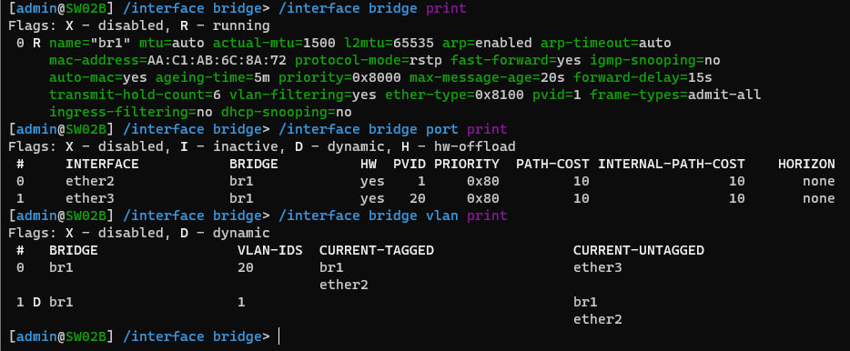

## Проверка получения IP-адреса на PC1

Для проверки был запущен DHCP-клиент на интерфейсе `eth1`.

```sh
udhcpc -i eth1
ip addr show eth1
ping -c 4 192.168.10.1
```

### Результат

PC1 получил IP-адрес из сети VLAN 10:

* IP-адрес: `192.168.10.199/24`
* шлюз: `192.168.10.1`

### Вывод DHCP-клиента на PC1

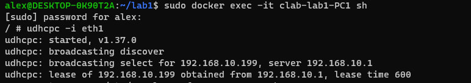

### Проверка IP-адреса PC1

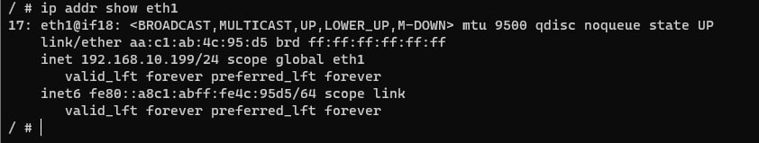

### Проверка связности PC1 с шлюзом

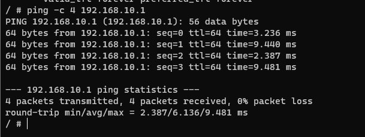

## Проверка получения IP-адреса на PC2

Для проверки был запущен DHCP-клиент на интерфейсе `eth1`.

```sh
udhcpc -i eth1
ip addr show eth1
ping -c 4 192.168.20.1
```

### Результат

PC2 получил IP-адрес из сети VLAN 20:

* IP-адрес: `192.168.20.199/24`
* шлюз: `192.168.20.1`

### Вывод DHCP-клиента на PC2

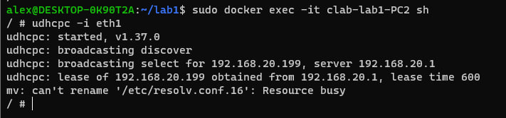

### Проверка IP-адреса PC2

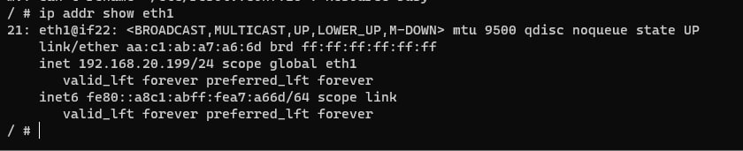

### Проверка связности PC2 с шлюзом

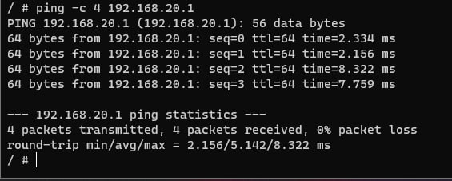


## Результаты лабораторной работы

В результате выполнения лабораторной работы были получены следующие результаты:

* подготовлен `.yaml` файл для развёртывания лабораторной сети в ContainerLab;
* подготовлена схема связи, нарисованная в draw.io;
* получены итоговые конфигурации для каждого сетевого устройства;
* успешно настроены VLAN 10 и VLAN 20;
* успешно настроены trunk и access-порты;
* на R01 успешно настроены DHCP-серверы для обеих VLAN;
* PC1 получил IP-адрес из сети `192.168.10.0/24`;
* PC2 получил IP-адрес из сети `192.168.20.0/24`;
* была проверена локальная связность до шлюзов:

  * `PC1 → 192.168.10.1`
  * `PC2 → 192.168.20.1`

## Вывод

В ходе лабораторной работы была успешно развернута трёхуровневая сеть предприятия в среде ContainerLab. На базе MikroTik RouterOS была реализована сегментация сети по VLAN, настроены trunk и access-порты на коммутаторах, а на центральном маршрутизаторе были созданы DHCP-серверы для двух пользовательских сетей.

Практическим результатом работы стало получение IP-адресов конечными узлами PC1 и PC2 по DHCP и подтверждение локальной связности с их шлюзами.

