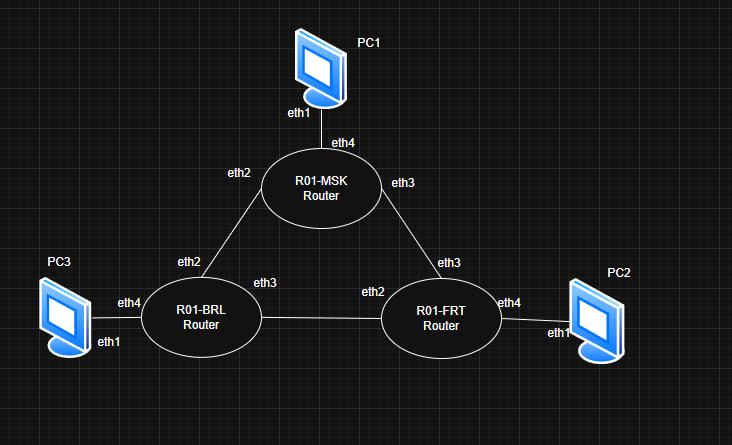
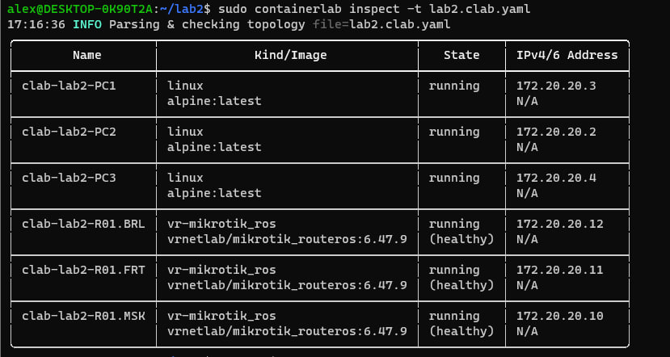
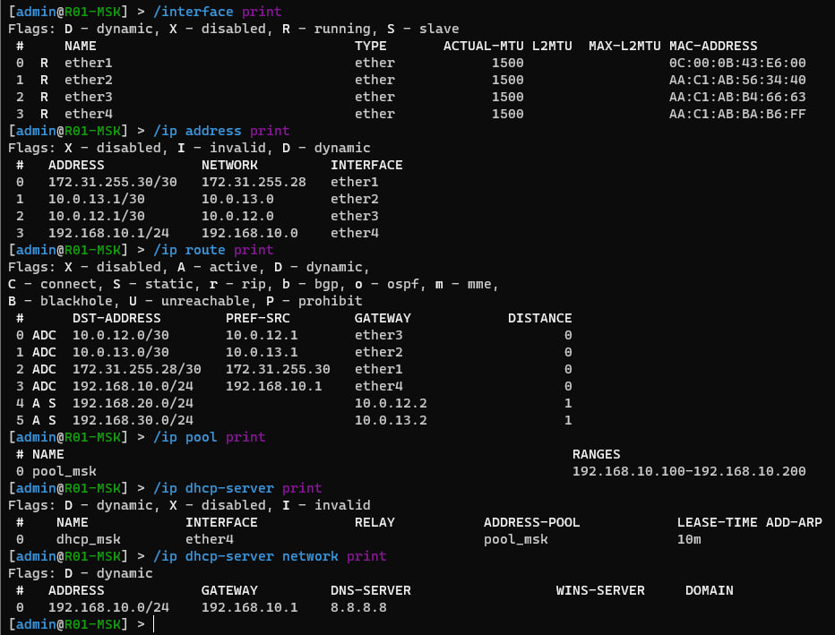
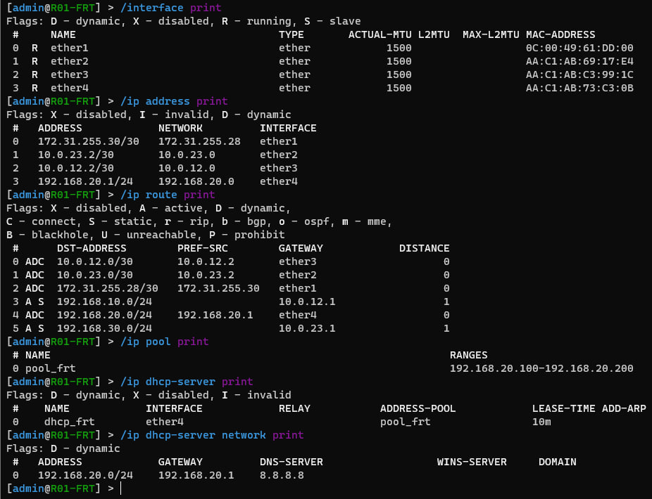
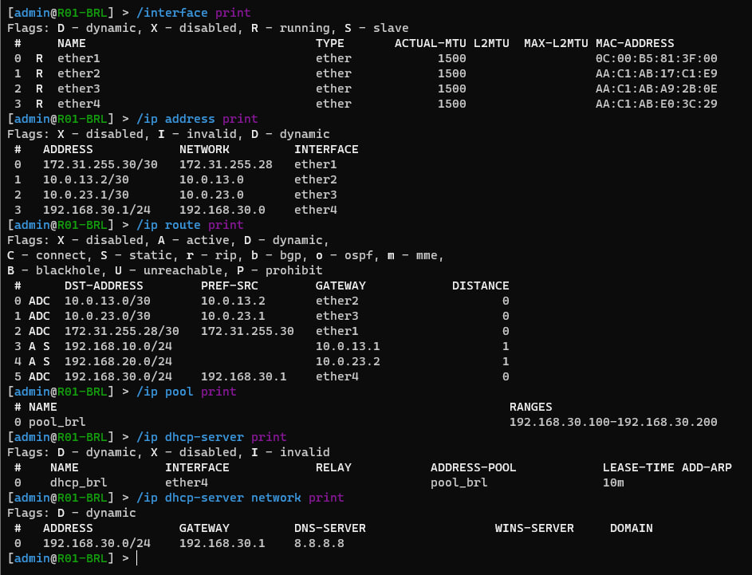
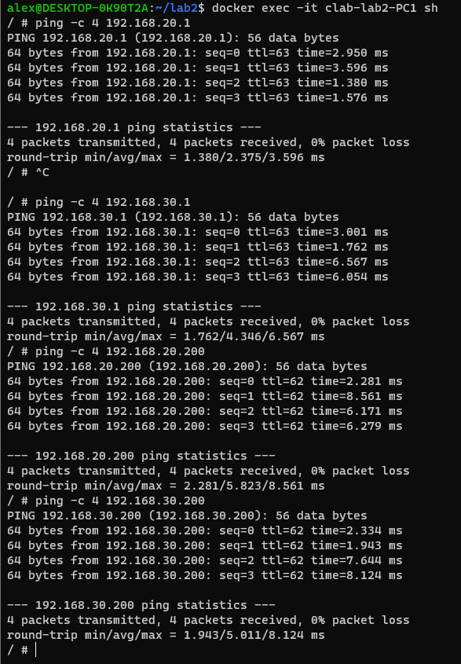
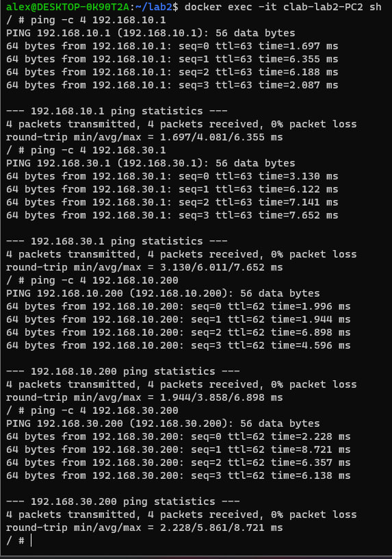
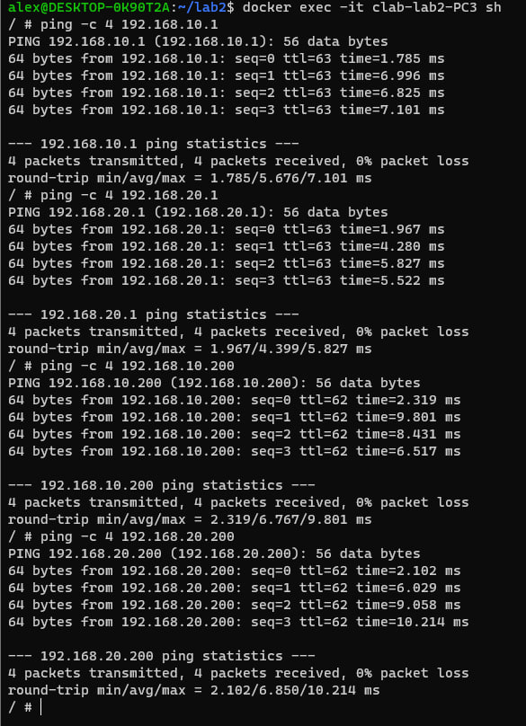

University: [ITMO University](https://itmo.ru/ru/)  

Faculty: [FICT](https://fict.itmo.ru)  

Course: [Introduction in routing](https://github.com/itmo-ict-faculty/introduction-in-routing)  

Year: 2025/2026 

Group: K3321 

Author: Царёв Александр Сергеевич

Lab: Lab2  

Date of create: 15.03

Date of finished:  

# Lab2. Эмуляция распределенной корпоративной сети связи, настройка статической маршрутизации между филиалами

## Цель работы

Ознакомиться с принципами планирования IP-адресации, настройкой статической маршрутизации и базовыми сетевыми функциями устройств в среде ContainerLab.

## Задание

В рамках лабораторной работы требовалось:

- развернуть в ContainerLab топологию сети, состоящую из маршрутизаторов `R01.MSK`, `R01.FRT`, `R01.BRL` и конечных узлов `PC1`, `PC2`, `PC3`;
- настроить IP-адресацию на интерфейсах маршрутизаторов;
- настроить DHCP-серверы для клиентских устройств в каждом филиале;
- настроить статическую маршрутизацию между филиалами;
- обеспечить связность между узлами московского, франкфуртского и берлинского офисов;
- выполнить проверку локальной и межфилиальной связности.

## Топология лабораторной сети

В лабораторной работе использовалась следующая топология:

- `R01.MSK` — маршрутизатор московского филиала
- `R01.FRT` — маршрутизатор франкфуртского филиала
- `R01.BRL` — маршрутизатор берлинского филиала
- `PC1` — клиент московского филиала
- `PC2` — клиент франкфуртского филиала
- `PC3` — клиент берлинского филиала

### Соединения между устройствами

- `R01.MSK:eth1 <-> R01.BRL:eth1`
- `R01.BRL:eth2 <-> R01.FRT:eth1`
- `R01.MSK:eth2 <-> R01.FRT:eth2`
- `R01.MSK:eth3 <-> PC1:eth1`
- `R01.FRT:eth3 <-> PC2:eth1`
- `R01.BRL:eth3 <-> PC3:eth1`

### IP-адреса для подключения по SSH

- `R01.MSK` — `172.20.20.10`
- `R01.FRT` — `172.20.20.11`
- `R01.BRL` — `172.20.20.12`

## Схема связи



## Файл развертывания ContainerLab

Для развёртывания виртуальной сети использовался следующий файл `lab2.clab.yaml`.

```yaml
name: lab2

mgmt:
  network: clab-mgmt
  ipv4-subnet: 172.20.20.0/24

topology:
  nodes:

    R01.MSK:
      kind: vr-mikrotik_ros
      image: vrnetlab/mikrotik_routeros:6.47.9
      mgmt-ipv4: 172.20.20.10

    R01.FRT:
      kind: vr-mikrotik_ros
      image: vrnetlab/mikrotik_routeros:6.47.9
      mgmt-ipv4: 172.20.20.11

    R01.BRL:
      kind: vr-mikrotik_ros
      image: vrnetlab/mikrotik_routeros:6.47.9
      mgmt-ipv4: 172.20.20.12

    PC1:
      kind: linux
      image: alpine:latest

    PC2:
      kind: linux
      image: alpine:latest

    PC3:
      kind: linux
      image: alpine:latest

  links:
    - endpoints: ["R01.MSK:eth1", "R01.BRL:eth1"]
    - endpoints: ["R01.BRL:eth2", "R01.FRT:eth1"]
    - endpoints: ["R01.MSK:eth2", "R01.FRT:eth2"]

    - endpoints: ["R01.MSK:eth3", "PC1:eth1"]
    - endpoints: ["R01.FRT:eth3", "PC2:eth1"]
    - endpoints: ["R01.BRL:eth3", "PC3:eth1"]
````

## Развёртывание сети

Для запуска виртуальной сети использовались следующие команды:

```bash
sudo containerlab destroy -t lab2.clab.yaml --cleanup
sudo containerlab deploy -t lab2.clab.yaml --reconfigure
sudo containerlab inspect -t lab2.clab.yaml
```

После развёртывания все контейнеры перешли в состояние `running`, а маршрутизаторы MikroTik успешно запустились и стали доступны для дальнейшей настройки.



## Особенность используемого образа RouterOS

В процессе выполнения лабораторной работы была обнаружена особенность образа `vrnetlab/mikrotik_routeros:6.47.9` в ContainerLab.

Несмотря на то, что в `.yaml` файле использовались интерфейсы `eth1`, `eth2` и `eth3`, внутри RouterOS первый интерфейс `ether1` был занят служебным соединением. В результате рабочие интерфейсы лабораторной топологии фактически оказались сдвинуты на один порт.

В ходе проверки командой:

```rsc
/interface print
/ip address print
```

было установлено следующее соответствие:

* `eth1` из ContainerLab соответствовал `ether2` в RouterOS;
* `eth2` из ContainerLab соответствовал `ether3` в RouterOS;
* `eth3` из ContainerLab соответствовал `ether4` в RouterOS.

После учёта этой особенности настройка IP-адресов и маршрутизации была выполнена корректно.

## План адресации

Для лабораторной работы были выбраны три пользовательские сети и три транзитные сети между маршрутизаторами.

### Пользовательские сети

| Филиал    | Подсеть           | Шлюз           |
| --------- | ----------------- | -------------- |
| Москва    | `192.168.10.0/24` | `192.168.10.1` |
| Франкфурт | `192.168.20.0/24` | `192.168.20.1` |
| Берлин    | `192.168.30.0/24` | `192.168.30.1` |

### Транзитные сети между маршрутизаторами

| Соединение          | Подсеть        | Адрес слева | Адрес справа |
| ------------------- | -------------- | ----------- | ------------ |
| `R01.MSK - R01.FRT` | `10.0.12.0/30` | `10.0.12.1` | `10.0.12.2`  |
| `R01.MSK - R01.BRL` | `10.0.13.0/30` | `10.0.13.1` | `10.0.13.2`  |
| `R01.BRL - R01.FRT` | `10.0.23.0/30` | `10.0.23.1` | `10.0.23.2`  |

### DHCP-пулы

* Москва: `192.168.10.100 - 192.168.10.200`
* Франкфурт: `192.168.20.100 - 192.168.20.200`
* Берлин: `192.168.30.100 - 192.168.30.200`

## Конфигурация устройств

В данном разделе приведены итоговые рабочие конфигурации сетевых устройств.

## Конфигурация R01.MSK

На `R01.MSK` были настроены два WAN-интерфейса в сторону других филиалов, LAN-интерфейс в сторону `PC1`, DHCP-сервер для локальной сети и статические маршруты в удалённые филиалы.

```rsc
/system identity set name=R01-MSK
/user set admin password=123

/ip address
add address=10.0.13.1/30 interface=ether2
add address=10.0.12.1/30 interface=ether3
add address=192.168.10.1/24 interface=ether4

/ip pool
add name=pool_msk ranges=192.168.10.100-192.168.10.200

/ip dhcp-server
add name=dhcp_msk interface=ether4 address-pool=pool_msk disabled=no

/ip dhcp-server network
add address=192.168.10.0/24 gateway=192.168.10.1 dns-server=8.8.8.8

/ip route
add dst-address=192.168.20.0/24 gateway=10.0.12.2
add dst-address=192.168.30.0/24 gateway=10.0.13.2
```

### Проверка конфигурации R01.MSK

```rsc
/interface print
/ip address print
/ip route print
/ip pool print
/ip dhcp-server print
/ip dhcp-server network print
```



## Конфигурация R01.FRT

На `R01.FRT` были настроены два WAN-интерфейса в сторону других филиалов, LAN-интерфейс в сторону `PC2`, DHCP-сервер для локальной сети и статические маршруты в удалённые филиалы.

```rsc
/system identity set name=R01-FRT
/user set admin password=123

/ip address
add address=10.0.23.2/30 interface=ether2
add address=10.0.12.2/30 interface=ether3
add address=192.168.20.1/24 interface=ether4

/ip pool
add name=pool_frt ranges=192.168.20.100-192.168.20.200

/ip dhcp-server
add name=dhcp_frt interface=ether4 address-pool=pool_frt disabled=no

/ip dhcp-server network
add address=192.168.20.0/24 gateway=192.168.20.1 dns-server=8.8.8.8

/ip route
add dst-address=192.168.10.0/24 gateway=10.0.12.1
add dst-address=192.168.30.0/24 gateway=10.0.23.1
```

### Проверка конфигурации R01.FRT

```rsc
/interface print
/ip address print
/ip route print
/ip pool print
/ip dhcp-server print
/ip dhcp-server network print
```



## Конфигурация R01.BRL

На `R01.BRL` были настроены два WAN-интерфейса в сторону других филиалов, LAN-интерфейс в сторону `PC3`, DHCP-сервер для локальной сети и статические маршруты в удалённые филиалы.

```rsc
/system identity set name=R01-BRL
/user set admin password=123

/ip address
add address=10.0.13.2/30 interface=ether2
add address=10.0.23.1/30 interface=ether3
add address=192.168.30.1/24 interface=ether4

/ip pool
add name=pool_brl ranges=192.168.30.100-192.168.30.200

/ip dhcp-server
add name=dhcp_brl interface=ether4 address-pool=pool_brl disabled=no

/ip dhcp-server network
add address=192.168.30.0/24 gateway=192.168.30.1 dns-server=8.8.8.8

/ip route
add dst-address=192.168.10.0/24 gateway=10.0.13.1
add dst-address=192.168.20.0/24 gateway=10.0.23.2
```

### Проверка конфигурации R01.BRL

```rsc
/interface print
/ip address print
/ip route print
/ip pool print
/ip dhcp-server print
/ip dhcp-server network print
```



## Проверка получения IP-адреса на PC1

Для проверки был запущен DHCP-клиент на интерфейсе `eth1`.

```sh
udhcpc -i eth1
ip addr show eth1
ip route
ping -c 4 192.168.10.1
```

### Результат

PC1 получил IP-адрес из сети московского филиала:

* IP-адрес: `192.168.10.200/24`
* шлюз: `192.168.10.1`

### Вывод DHCP-клиента на PC1



### Проверка IP-адреса PC1



### Проверка связности PC1 с локальным шлюзом



## Проверка получения IP-адреса на PC2

Для проверки был запущен DHCP-клиент на интерфейсе `eth1`.

```sh
udhcpc -i eth1
ip addr show eth1
ip route
ping -c 4 192.168.20.1
```

### Результат

PC2 получил IP-адрес из сети франкфуртского филиала:

* IP-адрес: `192.168.20.200/24`
* шлюз: `192.168.20.1`

### Вывод DHCP-клиента на PC2


### Проверка IP-адреса PC2


### Проверка связности PC2 с локальным шлюзом


## Проверка получения IP-адреса на PC3

Для проверки был запущен DHCP-клиент на интерфейсе `eth1`.

```sh
udhcpc -i eth1
ip addr show eth1
ip route
ping -c 4 192.168.30.1
```

### Результат

PC3 получил IP-адрес из сети берлинского филиала:

* IP-адрес: `192.168.30.200/24`
* шлюз: `192.168.30.1`

### Вывод DHCP-клиента на PC3


### Проверка IP-адреса PC3


### Проверка связности PC3 с локальным шлюзом


## Особенность маршрутизации на клиентских контейнерах

В процессе проверки было установлено, что Linux-контейнеры `PC1`, `PC2` и `PC3` автоматически имели два маршрута по умолчанию:

* через интерфейс `eth0` в management-сеть `172.20.20.0/24`;
* через интерфейс `eth1` в пользовательскую сеть филиала.

Из-за этого часть межфилиального трафика первоначально направлялась через management-сеть, что приводило к отсутствию связности между конечными узлами разных офисов.

Для корректной работы было выполнено удаление лишнего маршрута по умолчанию через `eth0` на каждом ПК:

```sh
ip route del default via 172.20.20.1 dev eth0
ip route
```

После этого у каждого клиентского контейнера в качестве основного маршрута по умолчанию остался только шлюз соответствующего филиала, и межфилиальная связность заработала корректно.

## Проверка межфилиальной связности

После настройки маршрутов на клиентских устройствах была выполнена проверка связности между филиалами.

### Проверка с PC1

```sh
ping -c 4 192.168.20.1
ping -c 4 192.168.30.1
ping -c 4 192.168.20.200
ping -c 4 192.168.30.200
```

Результаты показали успешную доступность:

* маршрутизатора франкфуртского филиала `192.168.20.1`;
* маршрутизатора берлинского филиала `192.168.30.1`;
* узла `PC2` с адресом `192.168.20.200`;
* узла `PC3` с адресом `192.168.30.200`.


### Проверка с PC2

```sh
ping -c 4 192.168.10.1
ping -c 4 192.168.30.1
ping -c 4 192.168.10.200
ping -c 4 192.168.30.200
```

Результаты показали успешную доступность:

* маршрутизатора московского филиала `192.168.10.1`;
* маршрутизатора берлинского филиала `192.168.30.1`;
* узла `PC1` с адресом `192.168.10.200`;
* узла `PC3` с адресом `192.168.30.200`.


### Проверка с PC3

```sh
ping -c 4 192.168.10.1
ping -c 4 192.168.20.1
ping -c 4 192.168.10.200
ping -c 4 192.168.20.200
```

Результаты показали успешную доступность:

* маршрутизатора московского филиала `192.168.10.1`;
* маршрутизатора франкфуртского филиала `192.168.20.1`;
* узла `PC1` с адресом `192.168.10.200`;
* узла `PC2` с адресом `192.168.20.200`.


## Результаты лабораторной работы

В результате выполнения лабораторной работы были получены следующие результаты:

* подготовлен `.yaml` файл для развёртывания лабораторной сети в ContainerLab;
* подготовлена схема связи, отражающая взаимодействие трёх геораспределённых филиалов;
* получены итоговые конфигурации для каждого маршрутизатора;
* настроены DHCP-серверы для всех трёх локальных сетей;
* клиентские узлы `PC1`, `PC2` и `PC3` получили IP-адреса из своих подсетей;
* настроена статическая маршрутизация между филиалами;
* подтверждена локальная связность до шлюзов:

  * `PC1 → 192.168.10.1`
  * `PC2 → 192.168.20.1`
  * `PC3 → 192.168.30.1`
* подтверждена межфилиальная связность между конечными узлами:

  * `PC1 → PC2`
  * `PC1 → PC3`
  * `PC2 → PC3`

## Вывод

В ходе лабораторной работы была успешно реализована модель распределённой корпоративной сети связи в среде ContainerLab. Были настроены три маршрутизатора, объединяющие московский, франкфуртский и берлинский филиалы компании, выполнено планирование IP-адресации, настроены DHCP-серверы для клиентских устройств и реализована статическая маршрутизация между филиалами.

Практическим результатом работы стало получение IP-адресов конечными узлами `PC1`, `PC2` и `PC3`, а также подтверждение полной локальной и межфилиальной связности между всеми сегментами сети.
