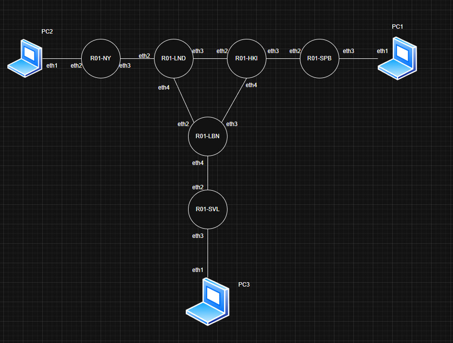
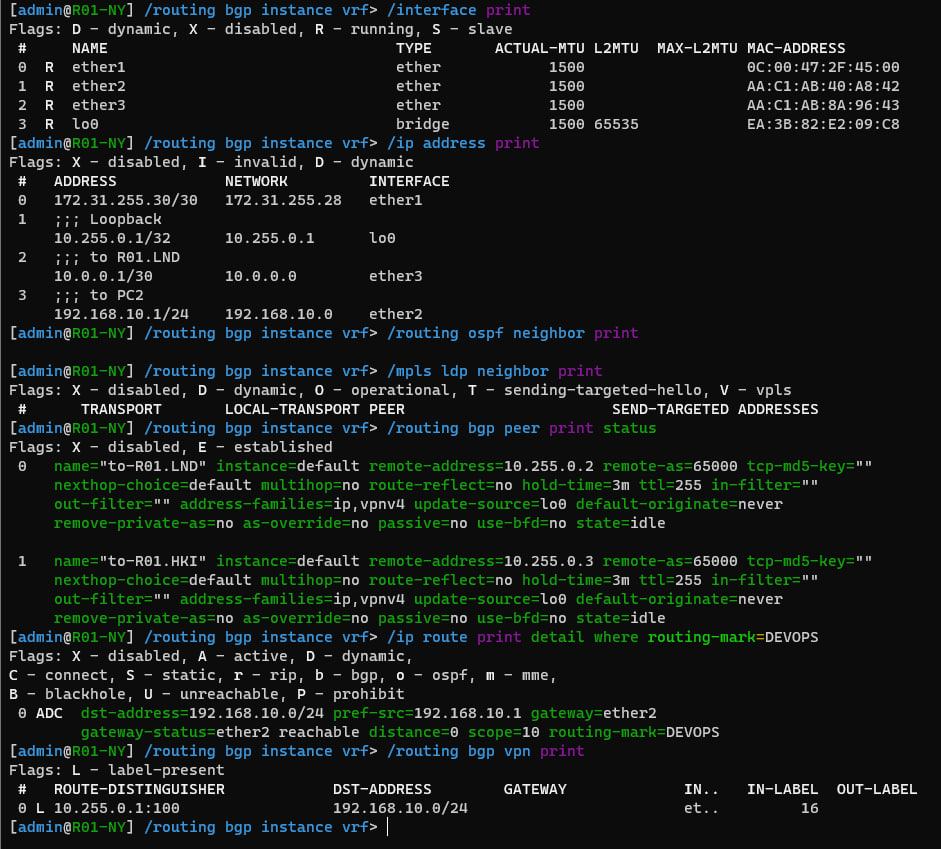
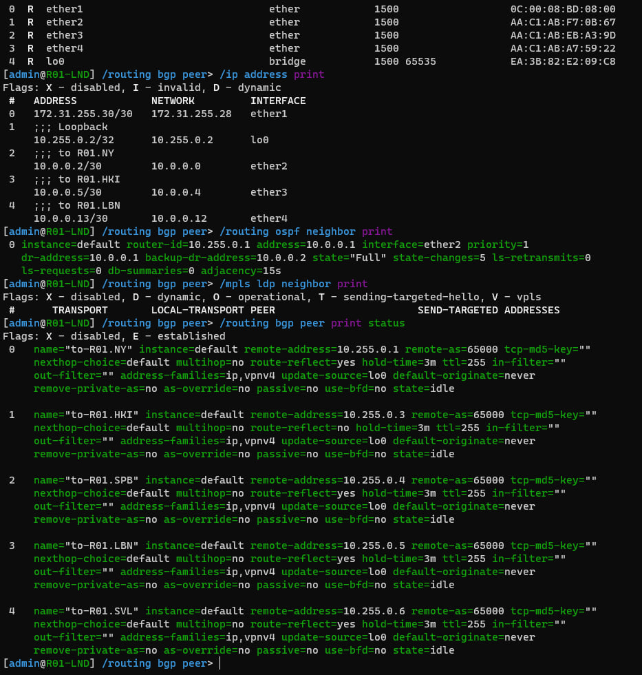
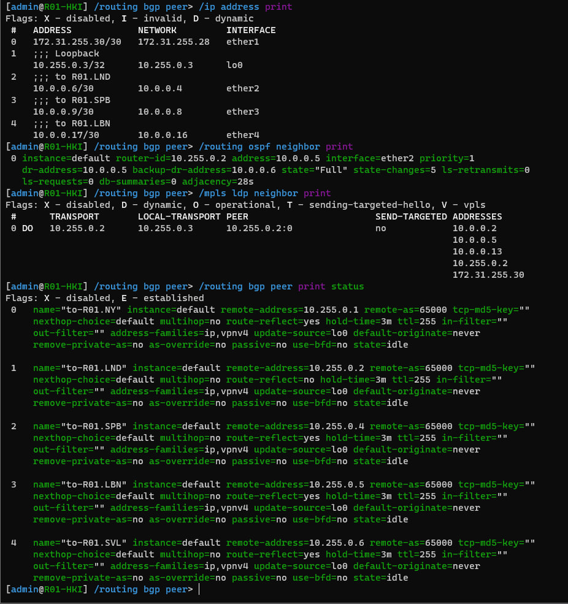
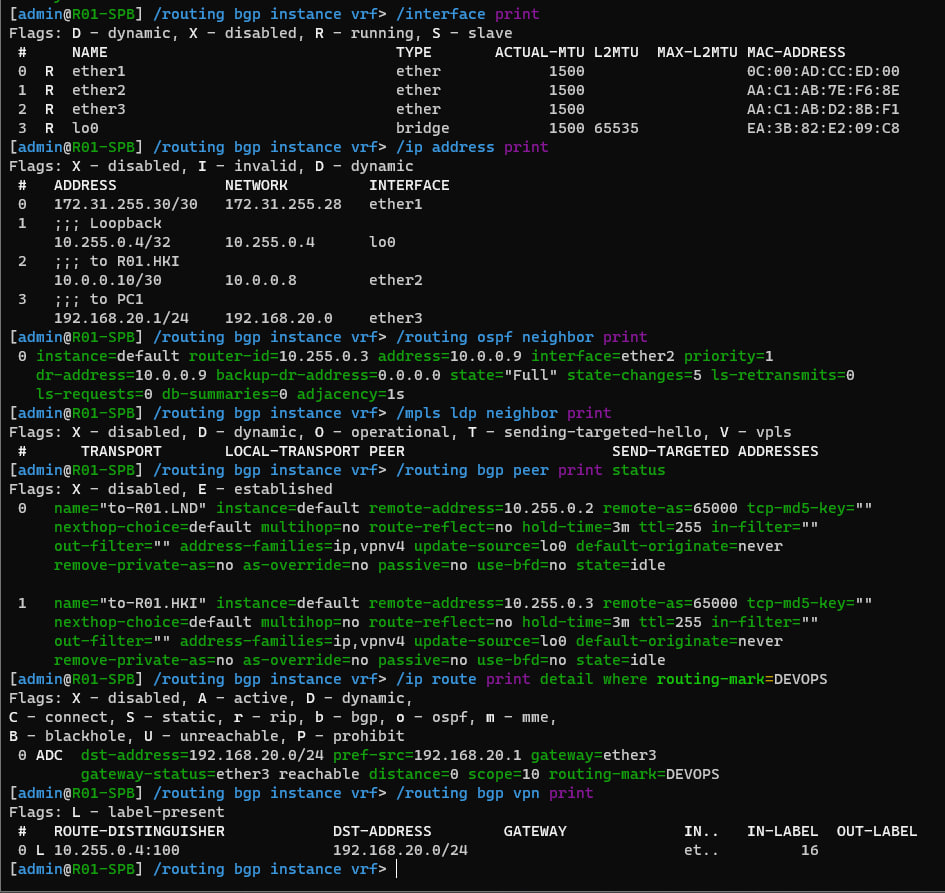
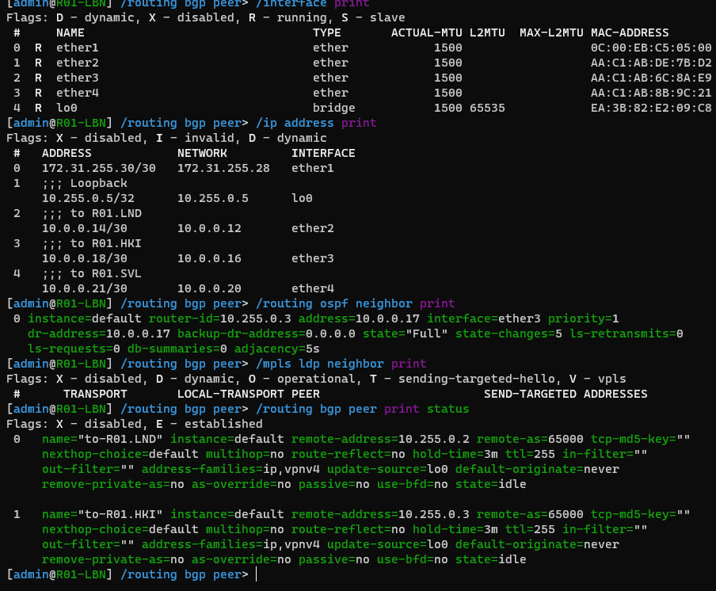
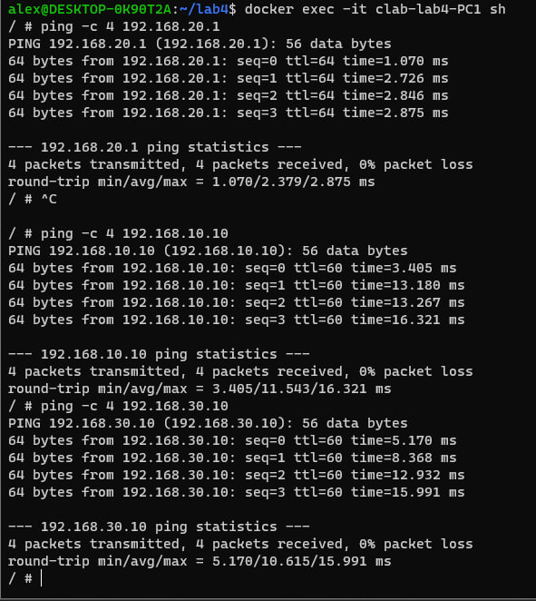
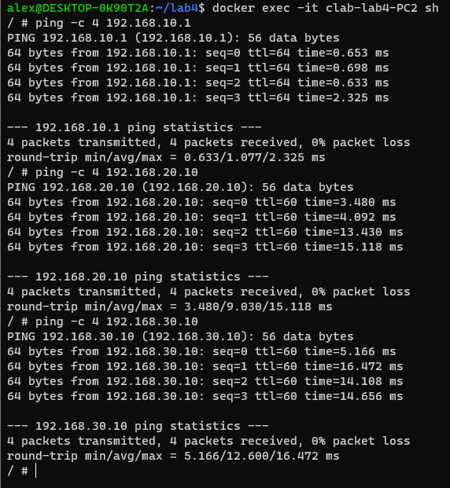
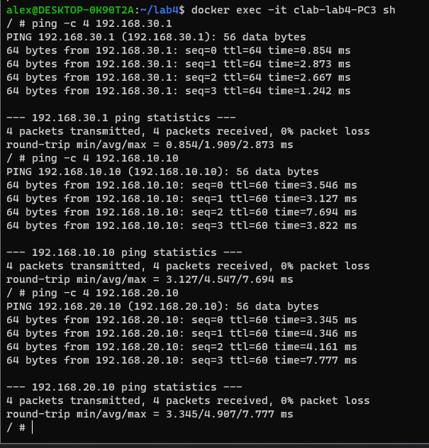
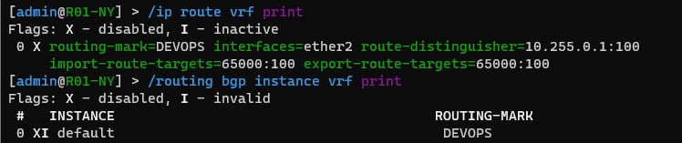

Ниже — готовый текст **отчёта по первой части лабораторной работы №4**, оформленный по структуре и стилю твоего отчёта из прошлой лабораторной: сначала цель и задание, потом топология, развёртывание, адресация, настройка OSPF/MPLS/iBGP/L3VPN, особенность с маршрутами на ПК, проверки и вывод. За основу я взял именно такую структуру разделов, как в твоём предыдущем отчёте. 

---

# Lab4. Эмуляция распределённой корпоративной сети связи, настройка iBGP, организация L3VPN

## Цель работы

Ознакомиться с принципами построения IP/MPLS-сети провайдера, настройкой OSPF и MPLS в магистральной сети, организацией iBGP с использованием Route Reflector Cluster, а также с практикой развёртывания MPLS L3VPN между несколькими офисами.

## Задание

В рамках первой части лабораторной работы требовалось:

* развернуть в ContainerLab топологию сети, состоящую из маршрутизаторов `R01.NY`, `R01.LND`, `R01.HKI`, `R01.SPB`, `R01.LBN`, `R01.SVL` и конечных узлов `PC1`, `PC2`, `PC3`;
* настроить IP-адресацию на транспортных и клиентских интерфейсах маршрутизаторов;
* настроить loopback-интерфейсы на всех маршрутизаторах;
* настроить OSPF в магистральной сети провайдера;
* настроить MPLS и LDP на транспортных каналах;
* настроить iBGP внутри автономной системы с использованием Route Reflector Cluster;
* создать VRF на пограничных маршрутизаторах;
* настроить RD и RT для передачи VPNv4-маршрутов;
* обеспечить связность между узлами `PC1`, `PC2` и `PC3`, расположенными в разных офисах, с помощью L3VPN;
* выполнить проверку локальной и межофисной связности.

## Топология лабораторной сети

В лабораторной работе использовалась следующая топология:

* `R01.NY` — пограничный маршрутизатор площадки New York
* `R01.LND` — магистральный маршрутизатор London
* `R01.HKI` — магистральный маршрутизатор Helsinki
* `R01.SPB` — пограничный маршрутизатор площадки Saint Petersburg
* `R01.LBN` — магистральный маршрутизатор Lisbon
* `R01.SVL` — пограничный маршрутизатор площадки Seville
* `PC1` — конечный узел площадки SPB
* `PC2` — конечный узел площадки NY
* `PC3` — конечный узел площадки SVL

### Соединения между устройствами

* `PC2:eth1 <-> R01.NY:eth1`
* `R01.NY:eth2 <-> R01.LND:eth1`
* `R01.LND:eth2 <-> R01.HKI:eth1`
* `R01.HKI:eth2 <-> R01.SPB:eth1`
* `R01.LND:eth3 <-> R01.LBN:eth1`
* `R01.HKI:eth3 <-> R01.LBN:eth2`
* `R01.LBN:eth3 <-> R01.SVL:eth1`
* `R01.SPB:eth2 <-> PC1:eth1`
* `R01.SVL:eth2 <-> PC3:eth1`

### IP-адреса для подключения по SSH

* `R01.NY` — `172.20.20.10`
* `R01.LND` — `172.20.20.11`
* `R01.HKI` — `172.20.20.12`
* `R01.SPB` — `172.20.20.13`
* `R01.LBN` — `172.20.20.14`
* `R01.SVL` — `172.20.20.15`

## Схема связи



## Файл развертывания ContainerLab

Для развёртывания виртуальной сети использовался файл `lab4.clab.yaml`.

```yaml
name: lab4

mgmt:
  network: clab-mgmt
  ipv4-subnet: 172.20.20.0/24

topology:
  nodes:

    R01.NY:
      kind: vr-mikrotik_ros
      image: vrnetlab/mikrotik_routeros:6.47.9
      mgmt-ipv4: 172.20.20.10

    R01.LND:
      kind: vr-mikrotik_ros
      image: vrnetlab/mikrotik_routeros:6.47.9
      mgmt-ipv4: 172.20.20.11

    R01.HKI:
      kind: vr-mikrotik_ros
      image: vrnetlab/mikrotik_routeros:6.47.9
      mgmt-ipv4: 172.20.20.12

    R01.SPB:
      kind: vr-mikrotik_ros
      image: vrnetlab/mikrotik_routeros:6.47.9
      mgmt-ipv4: 172.20.20.13

    R01.LBN:
      kind: vr-mikrotik_ros
      image: vrnetlab/mikrotik_routeros:6.47.9
      mgmt-ipv4: 172.20.20.14

    R01.SVL:
      kind: vr-mikrotik_ros
      image: vrnetlab/mikrotik_routeros:6.47.9
      mgmt-ipv4: 172.20.20.15

    PC1:
      kind: linux
      image: alpine:latest

    PC2:
      kind: linux
      image: alpine:latest

    PC3:
      kind: linux
      image: alpine:latest

  links:
    - endpoints: ["PC2:eth1", "R01.NY:eth1"]
    - endpoints: ["R01.NY:eth2", "R01.LND:eth1"]
    - endpoints: ["R01.LND:eth2", "R01.HKI:eth1"]
    - endpoints: ["R01.HKI:eth2", "R01.SPB:eth1"]
    - endpoints: ["R01.LND:eth3", "R01.LBN:eth1"]
    - endpoints: ["R01.HKI:eth3", "R01.LBN:eth2"]
    - endpoints: ["R01.LBN:eth3", "R01.SVL:eth1"]
    - endpoints: ["R01.SPB:eth2", "PC1:eth1"]
    - endpoints: ["R01.SVL:eth2", "PC3:eth1"]
```

## Развёртывание сети

Для запуска виртуальной сети использовались следующие команды:

```bash
sudo containerlab destroy -t lab4.clab.yaml --cleanup
sudo containerlab deploy -t lab4.clab.yaml
sudo containerlab inspect -t lab4.clab.yaml
```

После развёртывания все контейнеры перешли в состояние `running`, а маршрутизаторы MikroTik успешно запустились и стали доступны для дальнейшей настройки.

Следует учитывать особенность образа `vrnetlab/mikrotik_routeros:6.47.9`: интерфейс `ether1` внутри RouterOS используется под management-подключение. Поэтому интерфейсы, указанные в `lab4.clab.yaml` как `eth1`, `eth2`, `eth3`, внутри MikroTik отображаются как `ether2`, `ether3`, `ether4`.



## План адресации

Для лабораторной работы были выбраны loopback-сети, транзитные сети между маршрутизаторами и пользовательские сети трёх офисов.

### Loopback-интерфейсы

| Устройство | Loopback        |
| ---------- | --------------- |
| `R01.NY`   | `10.255.0.1/32` |
| `R01.LND`  | `10.255.0.2/32` |
| `R01.HKI`  | `10.255.0.3/32` |
| `R01.SPB`  | `10.255.0.4/32` |
| `R01.LBN`  | `10.255.0.5/32` |
| `R01.SVL`  | `10.255.0.6/32` |

### Транзитные сети между маршрутизаторами

| Соединение          | Подсеть        | Адрес слева | Адрес справа |
| ------------------- | -------------- | ----------- | ------------ |
| `R01.NY - R01.LND`  | `10.0.0.0/30`  | `10.0.0.1`  | `10.0.0.2`   |
| `R01.LND - R01.HKI` | `10.0.0.4/30`  | `10.0.0.5`  | `10.0.0.6`   |
| `R01.HKI - R01.SPB` | `10.0.0.8/30`  | `10.0.0.9`  | `10.0.0.10`  |
| `R01.LND - R01.LBN` | `10.0.0.12/30` | `10.0.0.13` | `10.0.0.14`  |
| `R01.HKI - R01.LBN` | `10.0.0.16/30` | `10.0.0.17` | `10.0.0.18`  |
| `R01.LBN - R01.SVL` | `10.0.0.20/30` | `10.0.0.21` | `10.0.0.22`  |

### Пользовательские сети

| Площадка | Подсеть           | Шлюз           |
| -------- | ----------------- | -------------- |
| NY       | `192.168.10.0/24` | `192.168.10.1` |
| SPB      | `192.168.20.0/24` | `192.168.20.1` |
| SVL      | `192.168.30.0/24` | `192.168.30.1` |

## Конфигурация устройств

В данном разделе приведены итоговые рабочие конфигурации сетевых устройств для первой части лабораторной работы.

## Конфигурация R01.NY

На `R01.NY` были настроены loopback-интерфейс, транспортный интерфейс в сторону `R01.LND`, пользовательский интерфейс в сторону `PC2`, OSPF, MPLS/LDP, iBGP-соседства с route reflector и VRF `DEVOPS` для участия в L3VPN.

```rsc
/system identity set name=R01.NY

/interface bridge add name=lo0

/ip address
add address=10.255.0.1/32 interface=lo0 comment=Loopback
add address=10.0.0.1/30 interface=ether3 comment="to R01.LND"
add address=192.168.10.1/24 interface=ether2 comment="to PC2"

/routing ospf instance
set [ find default=yes ] router-id=10.255.0.1

/routing ospf network
add network=10.255.0.1/32 area=backbone
add network=10.0.0.0/30 area=backbone

/mpls interface
add interface=ether3

/mpls ldp
set enabled=yes lsr-id=10.255.0.1 transport-address=10.255.0.1

/mpls ldp interface
add interface=ether3

/routing bgp instance
set default as=65000 router-id=10.255.0.1

/routing bgp peer
add name=to-R01.LND remote-address=10.255.0.2 remote-as=65000 update-source=lo0 address-families=ip,vpnv4
add name=to-R01.HKI remote-address=10.255.0.3 remote-as=65000 update-source=lo0 address-families=ip,vpnv4

/ip route vrf
add routing-mark=DEVOPS interfaces=ether2 route-distinguisher=10.255.0.1:100 import-route-targets=65000:100 export-route-targets=65000:100

/routing bgp instance vrf
add instance=default routing-mark=DEVOPS redistribute-connected=yes
```

### Проверка конфигурации R01.NY

```rsc
/interface print
/ip address print
/routing ospf neighbor print
/mpls ldp neighbor print
/routing bgp peer print status
/ip route print detail where routing-mark=DEVOPS
/routing bgp vpn print
```



## Конфигурация R01.LND

На `R01.LND` были настроены loopback-интерфейс, три транспортных интерфейса, OSPF, MPLS/LDP и iBGP-соседства. Маршрутизатор использовался как один из route reflector в кластере.

```rsc
/system identity set name=R01.LND

/interface bridge add name=lo0

/ip address
add address=10.255.0.2/32 interface=lo0 comment=Loopback
add address=10.0.0.2/30 interface=ether2 comment="to R01.NY"
add address=10.0.0.5/30 interface=ether3 comment="to R01.HKI"
add address=10.0.0.13/30 interface=ether4 comment="to R01.LBN"

/routing ospf instance
set [ find default=yes ] router-id=10.255.0.2

/routing ospf network
add network=10.255.0.2/32 area=backbone
add network=10.0.0.0/30 area=backbone
add network=10.0.0.4/30 area=backbone
add network=10.0.0.12/30 area=backbone

/mpls interface
add interface=ether2
add interface=ether3
add interface=ether4

/mpls ldp
set enabled=yes lsr-id=10.255.0.2 transport-address=10.255.0.2

/mpls ldp interface
add interface=ether2
add interface=ether3
add interface=ether4

/routing bgp instance
set default as=65000 router-id=10.255.0.2

/routing bgp peer
add name=to-R01.NY remote-address=10.255.0.1 remote-as=65000 update-source=lo0 route-reflect=yes address-families=ip,vpnv4
add name=to-R01.HKI remote-address=10.255.0.3 remote-as=65000 update-source=lo0 address-families=ip,vpnv4
add name=to-R01.SPB remote-address=10.255.0.4 remote-as=65000 update-source=lo0 route-reflect=yes address-families=ip,vpnv4
add name=to-R01.LBN remote-address=10.255.0.5 remote-as=65000 update-source=lo0 route-reflect=yes address-families=ip,vpnv4
add name=to-R01.SVL remote-address=10.255.0.6 remote-as=65000 update-source=lo0 route-reflect=yes address-families=ip,vpnv4
```

### Проверка конфигурации R01.LND

```rsc
/interface print
/ip address print
/routing ospf neighbor print
/mpls ldp neighbor print
/routing bgp peer print status
```



## Конфигурация R01.HKI

На `R01.HKI` были настроены loopback-интерфейс, три транспортных интерфейса, OSPF, MPLS/LDP и iBGP-соседства. Маршрутизатор использовался как второй route reflector в кластере.

```rsc
/system identity set name=R01.HKI

/interface bridge add name=lo0

/ip address
add address=10.255.0.3/32 interface=lo0 comment=Loopback
add address=10.0.0.6/30 interface=ether2 comment="to R01.LND"
add address=10.0.0.9/30 interface=ether3 comment="to R01.SPB"
add address=10.0.0.17/30 interface=ether4 comment="to R01.LBN"

/routing ospf instance
set [ find default=yes ] router-id=10.255.0.3

/routing ospf network
add network=10.255.0.3/32 area=backbone
add network=10.0.0.4/30 area=backbone
add network=10.0.0.8/30 area=backbone
add network=10.0.0.16/30 area=backbone

/mpls interface
add interface=ether2
add interface=ether3
add interface=ether4

/mpls ldp
set enabled=yes lsr-id=10.255.0.3 transport-address=10.255.0.3

/mpls ldp interface
add interface=ether2
add interface=ether3
add interface=ether4

/routing bgp instance
set default as=65000 router-id=10.255.0.3

/routing bgp peer
add name=to-R01.NY remote-address=10.255.0.1 remote-as=65000 update-source=lo0 route-reflect=yes address-families=ip,vpnv4
add name=to-R01.LND remote-address=10.255.0.2 remote-as=65000 update-source=lo0 address-families=ip,vpnv4
add name=to-R01.SPB remote-address=10.255.0.4 remote-as=65000 update-source=lo0 route-reflect=yes address-families=ip,vpnv4
add name=to-R01.LBN remote-address=10.255.0.5 remote-as=65000 update-source=lo0 route-reflect=yes address-families=ip,vpnv4
add name=to-R01.SVL remote-address=10.255.0.6 remote-as=65000 update-source=lo0 route-reflect=yes address-families=ip,vpnv4
```

### Проверка конфигурации R01.HKI

```rsc
/interface print
/ip address print
/routing ospf neighbor print
/mpls ldp neighbor print
/routing bgp peer print status
```



## Конфигурация R01.SPB

На `R01.SPB` были настроены loopback-интерфейс, транспортный интерфейс в сторону `R01.HKI`, пользовательский интерфейс в сторону `PC1`, OSPF, MPLS/LDP, iBGP-соседства и VRF `DEVOPS`.

```rsc
/system identity set name=R01.SPB

/interface bridge add name=lo0

/ip address
add address=10.255.0.4/32 interface=lo0 comment=Loopback
add address=10.0.0.10/30 interface=ether2 comment="to R01.HKI"
add address=192.168.20.1/24 interface=ether3 comment="to PC1"

/routing ospf instance
set [ find default=yes ] router-id=10.255.0.4

/routing ospf network
add network=10.255.0.4/32 area=backbone
add network=10.0.0.8/30 area=backbone

/mpls interface
add interface=ether2

/mpls ldp
set enabled=yes lsr-id=10.255.0.4 transport-address=10.255.0.4

/mpls ldp interface
add interface=ether2

/routing bgp instance
set default as=65000 router-id=10.255.0.4

/routing bgp peer
add name=to-R01.LND remote-address=10.255.0.2 remote-as=65000 update-source=lo0 address-families=ip,vpnv4
add name=to-R01.HKI remote-address=10.255.0.3 remote-as=65000 update-source=lo0 address-families=ip,vpnv4

/ip route vrf
add routing-mark=DEVOPS interfaces=ether3 route-distinguisher=10.255.0.4:100 import-route-targets=65000:100 export-route-targets=65000:100

/routing bgp instance vrf
add instance=default routing-mark=DEVOPS redistribute-connected=yes
```

### Проверка конфигурации R01.SPB

```rsc
/interface print
/ip address print
/routing ospf neighbor print
/mpls ldp neighbor print
/routing bgp peer print status
/ip route print detail where routing-mark=DEVOPS
/routing bgp vpn print
```



## Конфигурация R01.LBN

На `R01.LBN` были настроены loopback-интерфейс, три транспортных интерфейса, OSPF, MPLS/LDP и iBGP-соседства.

```rsc
/system identity set name=R01.LBN

/interface bridge add name=lo0

/ip address
add address=10.255.0.5/32 interface=lo0 comment=Loopback
add address=10.0.0.14/30 interface=ether2 comment="to R01.LND"
add address=10.0.0.18/30 interface=ether3 comment="to R01.HKI"
add address=10.0.0.21/30 interface=ether4 comment="to R01.SVL"

/routing ospf instance
set [ find default=yes ] router-id=10.255.0.5

/routing ospf network
add network=10.255.0.5/32 area=backbone
add network=10.0.0.12/30 area=backbone
add network=10.0.0.16/30 area=backbone
add network=10.0.0.20/30 area=backbone

/mpls interface
add interface=ether2
add interface=ether3
add interface=ether4

/mpls ldp
set enabled=yes lsr-id=10.255.0.5 transport-address=10.255.0.5

/mpls ldp interface
add interface=ether2
add interface=ether3
add interface=ether4

/routing bgp instance
set default as=65000 router-id=10.255.0.5

/routing bgp peer
add name=to-R01.LND remote-address=10.255.0.2 remote-as=65000 update-source=lo0 address-families=ip,vpnv4
add name=to-R01.HKI remote-address=10.255.0.3 remote-as=65000 update-source=lo0 address-families=ip,vpnv4
```

### Проверка конфигурации R01.LBN

```rsc
/interface print
/ip address print
/routing ospf neighbor print
/mpls ldp neighbor print
/routing bgp peer print status
```


## Конфигурация R01.SVL

На `R01.SVL` были настроены loopback-интерфейс, транспортный интерфейс в сторону `R01.LBN`, пользовательский интерфейс в сторону `PC3`, OSPF, MPLS/LDP, iBGP-соседства и VRF `DEVOPS`.

```rsc
/system identity set name=R01.SVL

/interface bridge add name=lo0

/ip address
add address=10.255.0.6/32 interface=lo0 comment=Loopback
add address=10.0.0.22/30 interface=ether2 comment="to R01.LBN"
add address=192.168.30.1/24 interface=ether3 comment="to PC3"

/routing ospf instance
set [ find default=yes ] router-id=10.255.0.6

/routing ospf network
add network=10.255.0.6/32 area=backbone
add network=10.0.0.20/30 area=backbone

/mpls interface
add interface=ether2

/mpls ldp
set enabled=yes lsr-id=10.255.0.6 transport-address=10.255.0.6

/mpls ldp interface
add interface=ether2

/routing bgp instance
set default as=65000 router-id=10.255.0.6

/routing bgp peer
add name=to-R01.LND remote-address=10.255.0.2 remote-as=65000 update-source=lo0 address-families=ip,vpnv4
add name=to-R01.HKI remote-address=10.255.0.3 remote-as=65000 update-source=lo0 address-families=ip,vpnv4

/ip route vrf
add routing-mark=DEVOPS interfaces=ether3 route-distinguisher=10.255.0.6:100 import-route-targets=65000:100 export-route-targets=65000:100

/routing bgp instance vrf
add instance=default routing-mark=DEVOPS redistribute-connected=yes
```

### Проверка конфигурации R01.SVL

```rsc
/interface print
/ip address print
/routing ospf neighbor print
/mpls ldp neighbor print
/routing bgp peer print status
/ip route print detail where routing-mark=DEVOPS
/routing bgp vpn print
```



## Проверка получения IP-адреса на PC

На пользовательских узлах были вручную настроены IP-адреса в соответствующих локальных сетях:

* `PC1` — `192.168.20.10/24`, шлюз `192.168.20.1`
* `PC2` — `192.168.10.10/24`, шлюз `192.168.10.1`
* `PC3` — `192.168.30.10/24`, шлюз `192.168.30.1`

## Особенность маршрутизации на клиентских контейнерах

В процессе проверки было установлено, что Linux-контейнеры `PC1`, `PC2` и `PC3` автоматически имели маршрут по умолчанию через management-интерфейс `eth0` в сеть `172.20.20.0/24`.

Из-за этого межофисный трафик первоначально направлялся через management-сеть, а не через пользовательский интерфейс `eth1`, подключённый к PE-маршрутизатору. Это приводило к отсутствию связности между конечными узлами разных площадок.

Для корректной работы было выполнено удаление лишнего маршрута по умолчанию через `eth0` и добавление маршрута по умолчанию через пользовательский шлюз на `eth1`.

### PC1

```sh
ip route del default via 172.20.20.1 dev eth0
ip route add default via 192.168.20.1 dev eth1
ip route
```

### PC2

```sh
ip route del default via 172.20.20.1 dev eth0
ip route add default via 192.168.10.1 dev eth1
ip route
```

### PC3

```sh
ip route del default via 172.20.20.1 dev eth0
ip route add default via 192.168.30.1 dev eth1
ip route
```

После этого у каждого контейнера в качестве основного маршрута по умолчанию остался только шлюз соответствующей площадки, и связность через L3VPN заработала корректно.

## Проверка локальной и межофисной связности

После настройки маршрутов на клиентских устройствах была выполнена проверка связности между площадками.

### Проверка с PC1

```sh
ping -c 4 192.168.20.1
ping -c 4 192.168.10.10
ping -c 4 192.168.30.10
```

Результаты показали успешную доступность:

* локального шлюза `192.168.20.1`;
* узла `PC2` с адресом `192.168.10.10`;
* узла `PC3` с адресом `192.168.30.10`.



### Проверка с PC2

```sh
ping -c 4 192.168.10.1
ping -c 4 192.168.20.10
ping -c 4 192.168.30.10
```

Результаты показали успешную доступность:

* локального шлюза `192.168.10.1`;
* узла `PC1` с адресом `192.168.20.10`;
* узла `PC3` с адресом `192.168.30.10`.



### Проверка с PC3

```sh
ping -c 4 192.168.30.1
ping -c 4 192.168.10.10
ping -c 4 192.168.20.10
```

Результаты показали успешную доступность:

* локального шлюза `192.168.30.1`;
* узла `PC2` с адресом `192.168.10.10`;
* узла `PC1` с адресом `192.168.20.10`.



## Результаты первой части лабораторной работы

В результате выполнения первой части лабораторной работы были получены следующие результаты:

* подготовлен `.yaml` файл для развёртывания лабораторной сети в ContainerLab;
* подготовлена схема связи IP/MPLS-сети провайдера;
* получены итоговые конфигурации для всех шести маршрутизаторов;
* настроены loopback-интерфейсы и транспортная IP-адресация;
* настроен OSPF в магистральной сети;
* настроен MPLS и LDP между соседними маршрутизаторами;
* настроен iBGP внутри автономной системы с использованием двух route reflector;
* созданы VRF `DEVOPS` на пограничных маршрутизаторах;
* настроены RD и RT для обмена VPNv4-маршрутами;
* подтверждена локальная связность до шлюзов:

  * `PC1 → 192.168.20.1`
  * `PC2 → 192.168.10.1`
  * `PC3 → 192.168.30.1`
* подтверждена межофисная связность между конечными узлами:

  * `PC1 → PC2`
  * `PC1 → PC3`
  * `PC2 → PC3`

## Вывод

В ходе первой части лабораторной работы была успешно реализована модель IP/MPLS-сети провайдера в среде ContainerLab. Были настроены магистральные маршрутизаторы и пограничные PE-устройства, выполнено планирование IP-адресации, настроены OSPF, MPLS/LDP и iBGP с использованием Route Reflector Cluster.

Практическим результатом работы стало построение MPLS L3VPN между тремя удалёнными площадками компании и подтверждение полной связности между конечными узлами `PC1`, `PC2` и `PC3`, находящимися в разных офисах.

---

Если хочешь, следующим сообщением я сразу напишу **вторую часть отчёта — про VPLS — в таком же стиле**.
